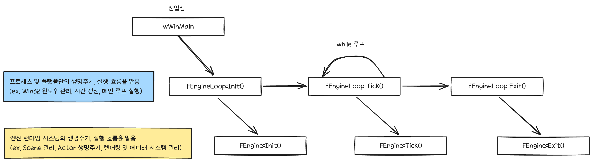
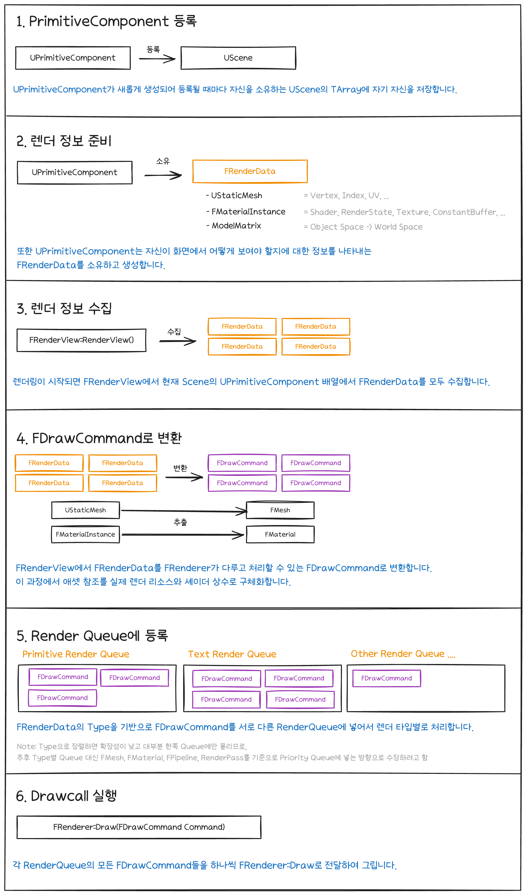
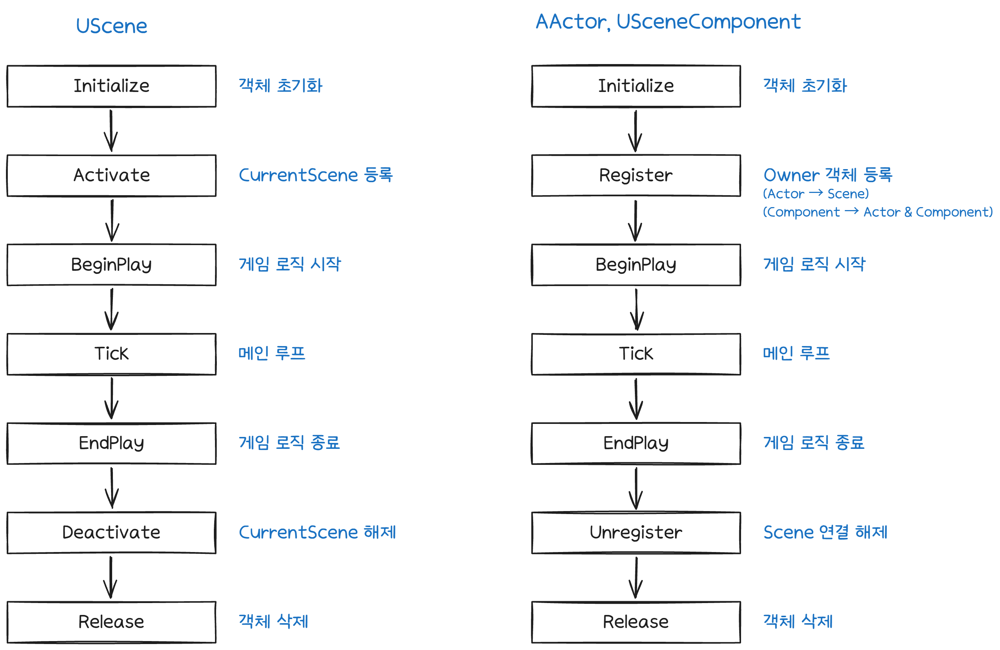
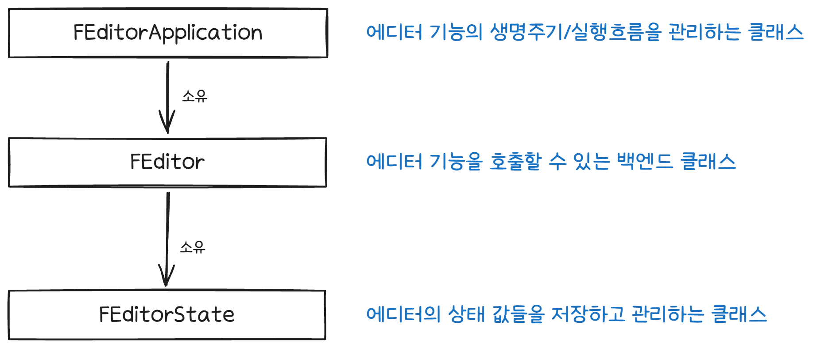

# Oiiaii 엔진 살펴보기

마지막 업데이트: 5주차 (2026-09-24)

[온보딩 문서로 돌아가기](./ONBOARDING.md)

이 문서에서는 Oiiaii 엔진을 누구나 쉽게 이해할 수 있도록 간단하게 살펴봅니다.

## 스펙

| 항목            | 설명               |
| --------------- | ------------------ |
| 컴파일러        | MSVC v145          |
| 플랫폼          | Windows Only       |
| IDE             | Visual Studio 2026 |
| C++ 표준        | C++20              |
| 그래픽스 백엔드 | DirectX11          |
| 빌드 시스템     | Premake5           |

## 외부 라이브러리

| 항목                                                | 설명                        |
| --------------------------------------------------- | --------------------------- |
| [ImGui](https://github.com/ocornut/imgui)           | 에디터 UI 구현에 사용       |
| [DirectXTK](https://github.com/microsoft/directxtk) | DDS 포맷 Decoding, Encoding |
| [nlohmann/json](https://github.com/nlohmann/json)   | JSON 직렬화 라이브러리      |
| [mINI](https://github.com/metayeti/mINI)            | INI 직렬화 라이브러리       |
| [Catch2](https://github.com/catchorg/catch2)        | 유닛 테스팅 라이브러리      |

## 코딩 컨벤션

- 이 프로젝트는 언리얼 엔진을 모방하는 엔진이므로, [언리얼의 코딩 규약](https://dev.epicgames.com/documentation/unreal-engine/epic-cplusplus-coding-standard-for-unreal-engine)을 따릅니다.

## 엔진 구조

### 메인 게임 루프

#### FEngineLoop::Init()

- 윈도우 프로세스 객체 초기화
- FEngine::Init() 실행

#### FEngineLoop::Tick()

- 엔진 종료 플래그 체크
- 윈도우 프로세스 메세지 펌프 처리
- 전역 시간 업데이트
- FEngine::Tick() 실행

#### FEngineLoop::Exit()

- FEngine::Exit() 실행
- 윈도우 프로세스 종료 실행

#### FEngine::Init()

- 렌더러 초기화
- 스탯 매니저, 메모리 초기화
- UClass 타입 정보 초기화
- Content에서 엔진 애셋 목록 불러와서 메모리에 로드
- ObjViewer 혹은 Editor 애플리케이션 로드 및 세팅
- 씬 매니저 초기화
- ImGui 초기화

#### FEngine::Tick()

- 렌더러 Resize 이벤트 처리
- Input Manager 프레임 입력 상태 갱신
- ObjViewer 혹은 Editor 애플리케이션 업데이트 및 렌더

#### FEngine::Exit()

- ObjViewer 혹은 Editor 애플리케이션 종료
- SceneManager 정리
- 렌더러 정리

### 렌더링 프로세스

### Scene, Actor, Component 생명주기

주의: 현재 Actor 코드가 약간 미완성이라 이 생명 주기 흐름이 반드시 보장되지 않습니다..

### EditorApplication 구조

## 장점

- 고양이가 귀엽다
- 나름 정돈된 코드 구조
- 지금 보고있는 이 문서가 있다

## 단점

### 낮은 가독성을 가진 코드들

저희도 가독성이 나쁘거나, 하나의 코드가 너무 많은 역할을 맡거나, 알고리즘 흐름이 복잡한 파일들이 꽤 있습니다. 대표적으로 아래 파일들이 있습니다.

- FRenderer.cpp (1100줄): 메인 렌더러

- 에디터 ImGui 계열 코드
    - FImguiEditorViewportWindow.cpp (850줄): Viewport UI의 렌더링 및 다중 Viewport 및 카메라 이동, 회전, 피킹을 모두 처리

    - FImguiPropertyWindow.cpp (700줄): Property 창 전체를 처리

- FResourceLoader.cpp (700줄): Content 폴더에서 리소스를 가져와서 FAssetRegistry에 로드시키는 코드

### 언리얼 스타일에서 벗어나는 부분들

- FEditorApplication, FObjViewerApplication 같이 "실행 모드의 구현"을 가리키는 클래스들이 언리얼에는 존재하지 않는 개념입니다.

- UPipeline은 언리얼에는 존재하지 않는 부분이라, 언리얼처럼 맞춘다면 UMaterial에 통합되어야 합니다.

### 일관성 없는 코딩 스타일

현재 2줄 띄어쓰기와 탭 문자가 혼재된 코드가 꽤 존재해서 가독성이 저하되는 구간이 있습니다.
