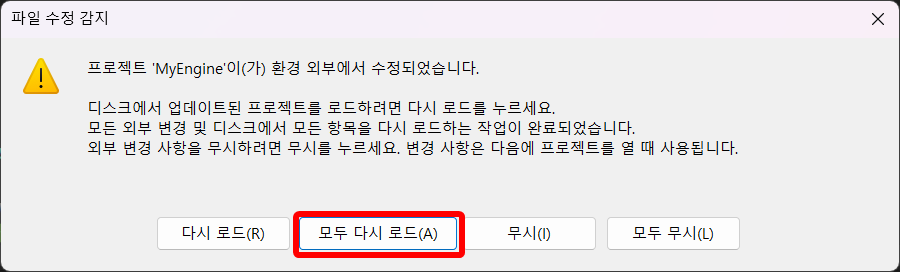

# 환경 세팅

마지막 업데이트: 5주차 (2026-09-24)

[온보딩 문서로 돌아가기](./ONBOARDING.md)

이 문서에서는 Oiiaii 엔진의 개발을 위한 세팅을 설명합니다.

# 준비물

- MSVC C++ 개발 환경을 갖추고 있는 Visual Studio 2026

## 1. Git Submodule

Oiiaii는 [DirectXTK](https://github.com/microsoft/directxtk)와 같은 라이브러리를 가져오기 위해 Git Submodule을 사용합니다.

이제 막 git clone을 하려고 한다면 아래 명령을 사용하여 git clone을 하면 됩니다.

```shell
git clone --recurse-submodules [git repository url]
```

혹은, 이미 git clone을 한 상태로 이 문서를 읽고 있다면, submodule을 clone 이후에도 추가하실 수도 있습니다.

```shell
git submodule update --init
```

Submodule에 대해 자세히 알아보고 싶으시면 [공식 문서](https://git-scm.com/book/ko/v2/Git-%EB%8F%84%EA%B5%AC-%EC%84%9C%EB%B8%8C%EB%AA%A8%EB%93%88)를 읽어보세요.

## 2. Premake5

> Premake5를 이미 여러번 써보았다면, 이 섹션은 건너뛰어도 괜찮습니다.

Oiiaii는 Visual Studio의 프로젝트/솔루션 파일 생성을 위해 [Premake5](https://premake.github.io/)를 사용합니다.

Premake5를 사용하면, 팀원들 사이에서 빌드 세팅을 보다 명확하게 동기화할 수도 있고, 필터 목록이 꼬여서 발생하는 git conflict를 줄일 수 있습니다.

만약 Premake5가 아직 설치되어 있지 않으시다면, 다음 명령어로 Premake5를 간단하게 설치하실 수 있습니다.

```shell
winget install --id Premake.Premake.5.Beta -v 5.0-beta8
```

Premake5가 정상적으로 설치되었다면, 프로젝트 루트 디렉토리에서 `premake5 vs2026` 명령을 사용하여 (premake가 아닌 premake"5" 입니다.) 프로젝트/솔루션 파일을 다시 만들 수 있습니다.

`premake5 vs2026` 명령은 이럴 때 실행하면 됩니다.

- cpp & h 파일을 추가/이동/삭제 했을 때
- 팀원이 새로운 cpp & h 파일을 추가/이동/삭제 했고 그걸 git pull로 받아왔을 때
- 빌드 세팅 수정을 위해서 premake5.lua 파일을 수정했을 때
- 혹은 그냥 프로젝트/솔루션 파일이 없거나 깨졌을 때

뭔 소린지 모르겠고 귀찮으시면, 그냥 뭔가 잘 안된다 싶으면 실행해주세요.

마지막으로, 혹시 `premake5 vs2026` 명령 실행후 아래와 같은 창이 뜨면 "모두 다시 로드"를 클릭하시면 됩니다.



### 팁: Premake5를 간단하게 실행하기

터미널 키고 일일히 타이핑하기 귀찮으신 분들을 위해 premake5를 간단히 실행하는 다른 2가지 방법을 소개합니다.

1. `GenerateProjects.bat` 쓰기
    - 프로젝트 루트 폴더에 "GenerateProjects.bat" 라는 스크립트가 있습니다. 이 스크립트를 클릭으로 실행하면 `premake5 vs2026`이 실행됩니다.

2. Visual Studio에 외부 도구로 등록하기
    - 아래 동영상을 참고해서 등록하시면 됩니다.

    https://github.com/user-attachments/assets/f1de5b58-538d-4f1e-9f6e-087c286d28b8

    <video controls src="./Resources/Register_Premake.mp4" width="720"></video>

## 3. 빌드 스크립트

Oiiaii 엔진은 빌드 과정에서 아래 작업이 필요합니다.

1. Content 폴더의 png, jpg 파일을 DDS 파일로 변환

2. Content 폴더를 빌드된 바이너리 폴더에 복사

이 과정을 빌드할때마다 수동으로 진행하면 매우 귀찮으니 Scripts 폴더에 Powershell 스크립트가 들어있고, premake5.lua에 pre/post build hook이 세팅되어있습니다.

Visual Studio에서 코드를 수정하고 빌드할때마다 위의 스크립트가 자동으로 실행되는데, 가끔 "**코드를 수정하지 않고 Content 폴더의 애셋만 건드리는 경우**"에는 빌드가 생략되어 위 스크립트가 실행되지 않습니다.

그럴때는 Root 디렉토리에서 "RunBuildScript_Debug.bat" 혹은 "RunBuildScript_Release.bat"을 실행하면 전처리/후처리 빌드 스크립트를 수동으로 실행시킬 수 있습니다. 빌드 스크립트를 실행 후 엔진을 키시면 됩니다.

## 빌드 및 실행하기

위의 과정이 모두 준비되었다면 이제 엔진을 실행할 준비가 되셨습니다.

1. GenerateProjects.bat를 실행하여 (혹은 `premake5 vs2026`을 실행하여) 솔루션 파일을 생성합니다.

2. Visual Studio 2026으로 솔루션 파일을 엽니다.

3. Debug 혹은 Release로 바이너리를 빌드합니다.

4. "Binaries" 폴더에 완성된 바이너리와 Content 폴더를 사용하시면 됩니다.
